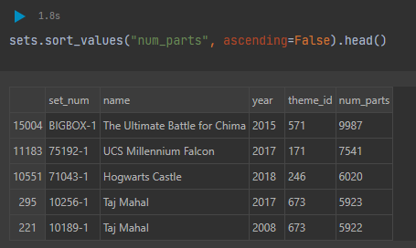
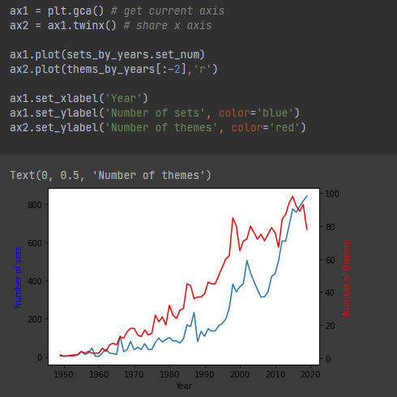
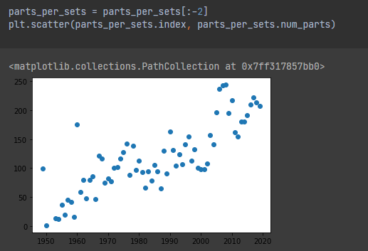

# DataAnalys_LegoSets
> Aggregate and Merge Data in Pandas while Analysing a Dataset of LEGO Pieces.

## Table of contents
* [General info](#general-info)
* [Screenshots](#screenshots)
* [Technologies](#technologies)
* [Setup](#setup)
* [Status](#status)

## General info
It is one of the Data Analysing projects which is suppoused to hone my skills in that category.

Main goals of the project were:
* Combine a Notebook with HTML Markup.
* Apply Python List slicing techniques to Pandas DataFrame.
* Aggregate data using the .agg() function.
* Create scatter plots, bar charts and line charts with two axes in Matplotlib.
* Merge DataFrames that share a common key.

As a notebook I used Datalore from Jetbrains.

Data used in this project were generated from Stack Overflow.

It's one of the projects from [Angela's Python Bootcamp](https://www.udemy.com/course/100-days-of-code/)

## Screenshots

## Technologies
* Python 3.8
* Pandas 1.3.3
* Matplotlib 3.4.3

## Setup
Import notebook and data from csv file into one of the Data Science Notebooks (f.e. Datalore).

## Status
Project is: _finished_.
